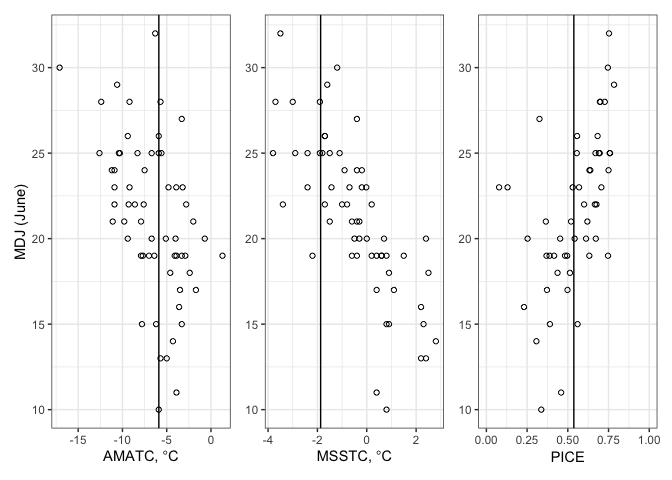

2021 Pre-Season Forecast
================

``` r
library(knitr)
library(dplyr)
library(ggplot2)
library(readr)
library(patchwork)
library(DT)
library(ggtext)
```

``` r
forecast_year <- 2021
suppressWarnings({
  dir.create("./figures")
  dir.create("./output")
})
theme_set(theme_bw())
```

## Data

``` r
environment <- read_csv("../../data/environment/environment.csv")
```

    ## 
    ## ── Column specification ────────────────────────────────────────────────────────
    ## cols(
    ##   year = col_double(),
    ##   amatc = col_double(),
    ##   pice = col_double(),
    ##   msstc = col_double()
    ## )

``` r
cpue <- read_csv("../../data/cpue/cpue.csv")
```

    ## 
    ## ── Column specification ────────────────────────────────────────────────────────
    ## cols(
    ##   year = col_double(),
    ##   fifdj = col_double(),
    ##   qdj = col_double(),
    ##   mdj = col_double()
    ## )

``` r
yukon <- left_join(environment, cpue)
```

    ## Joining, by = "year"

## Figures

### MDJ vs. AMATC

``` r
p_amatc <- ggplot(yukon, aes(amatc, mdj)) +
  geom_point(shape=1) +
  geom_vline(xintercept = yukon[which(yukon$year == forecast_year),"amatc"][[1]]) +
  labs(x = expression("AMATC,"*~degree*"C"), y = "MDJ (June)")

ggsave("./figures/mdj_against_amatc.png", width = 4, height = 4)
```

### MDJ vs. MSSTC

``` r
p_msstc <- ggplot(yukon, aes(msstc, mdj)) +
  geom_point(shape = 1) +
  geom_vline(xintercept = yukon[which(yukon$year == forecast_year),"msstc"][[1]]) +
  labs(x = expression("MSSTC,"*~degree*"C"), y = NULL)

ggsave("./figures/mdj_against_msstc.png", width = 4, height = 4)
```

### MDJ vs. PICE

``` r
p_pice <- ggplot(yukon, aes(pice, mdj)) +
  geom_point(shape=1) +
  geom_vline(xintercept = yukon[which(yukon$year == forecast_year),"pice"][[1]]) +
  scale_x_continuous(limits = c(0, 1.0)) +
  labs(x = "PICE", 
       y = NULL,
       caption = "MDJ against AMATC, MSSTC, and PICE, 1961–2020.<br>Solid vertical line marks the 2021 value for each variable.") +
  theme(plot.caption = element_markdown())

ggsave("./figures/mdj_against_pice.png", width = 4, height = 4)

p_amatc + p_msstc + p_pice
```

<!-- -->

``` r
ggsave("./figures/three_panel.png", width = 8, height = 3)
```

### Time series of AMATC, MSSTC, PICE

``` r
p1 <- ggplot(yukon, aes(year, amatc)) +
  geom_line() +
  geom_point(data = subset(yukon, year == forecast_year)) +
  geom_hline(yintercept = mean(yukon[yukon$year < forecast_year, "amatc"][[1]])) +
  labs(y = expression("AMATC,"*~degree*"C")) +
  theme(axis.title.x = element_blank())

p2 <- ggplot(yukon, aes(year, msstc)) +
  geom_line() +
  geom_point(data = subset(yukon, year == forecast_year)) +
  geom_hline(yintercept = mean(yukon[yukon$year < forecast_year, "msstc"][[1]])) +
  labs(y = expression("MSSTC,"*~degree*"C")) +
  theme(axis.title.x = element_blank())

p3 <- ggplot(yukon, aes(year, pice)) +
  geom_line() +
  geom_point(data = subset(yukon, year == forecast_year)) +
  geom_hline(yintercept = mean(yukon[yukon$year < forecast_year, "pice"][[1]], na.rm = TRUE)) +
  scale_y_continuous(limits = c(0, 1)) +
  labs(caption = "Time series of AMATC, MSSTC, and PICE, 1961–2021.<br>Solid circle mark indicates each series' value in 2021.",
       x = "Year",
       y = "PICE") +
  theme(plot.caption = element_markdown())

timeseries_3p <- p1 / p2 / p3
ggsave("./figures/timseries_3p.png", timeseries_3p, width = 8, height = 6)

timeseries_3p
```

<!-- -->

## Modeling

### Model Selection

``` r
models <- c("mdj ~ amatc",
            "mdj ~ msstc",
            "mdj ~ pice",
            "mdj ~ amatc + msstc",
            "mdj ~ amatc + pice",
            "mdj ~ msstc + pice",
            "mdj ~ amatc + msstc + pice")
models
```

    ## [1] "mdj ~ amatc"                "mdj ~ msstc"               
    ## [3] "mdj ~ pice"                 "mdj ~ amatc + msstc"       
    ## [5] "mdj ~ amatc + pice"         "mdj ~ msstc + pice"        
    ## [7] "mdj ~ amatc + msstc + pice"

# Set up selection

``` r
hindcast_window <- 15 # last n years
hindcast_years <- seq(forecast_year - hindcast_window, forecast_year - 1)
round_method <- floor # Floor predictions

hindcast_year <- function(data, model, forecast_year) {
  training_data <- data[data$year < forecast_year,]
  training_model <- lm(formula(model), training_data)
  
  new_data <- data[data$year == forecast_year,]
  prediction <- predict(training_model, newdata = new_data, se.fit=TRUE)
  prediction_fit <- round_method(prediction$fit[[1]])
  prediction_interval <- prediction_fit + c(-2, 2) * qnorm(0.975) *
    prediction$se.fit[[1]]
  
  actual <- new_data$mdj
  in_interval <- actual >= round_method(prediction_interval[1]) &&
    actual <= round_method(prediction_interval[2])
  
  data.frame(
    "formula"=model,
    "year"=forecast_year,
    "predicted"=(prediction_fit),
    "observed"=actual,
    "diff"=prediction_fit-actual,
    "predict_se"=prediction$se.fit[[1]],
    "in_interval"=in_interval,
    "int_lower"=prediction_interval[1],
    "int_upper"=prediction_interval[2],
    "int_width"=prediction_interval[2] -
      prediction_interval[1])
}

hindcast_model <- function(data, model, years, summarize = TRUE) {
  result <- lapply(years, function(year) {
    hindcast_year(data, model, year)
  })
  
  model_result <- do.call(rbind, result)
  
  if (!summarize) {
    return(model_result)
  }
  
  data.frame(
    model = model,
    "MAPE"=round(mean(abs(model_result$predicted - model_result$observed)), 2),
    "SDMAPE"=round(sd(abs(model_result$predicted - model_result$observed)), 2),
    "width"=round(mean(model_result$int_width), 2),
    "p.in"=round(sum(model_result$in_interval) / length(model_result$in_interval), 2),
    "absmax"=max(abs(model_result$predicted - model_result$observed)),
    "meanbias" = round(mean(model_result$predicted - model_result$observed), 2)
  )
}

hindcast_models <- function(data, models, years) {
  result <- lapply(models, function(model) {
    hindcast_model(data, model, years)
  })
  
  do.call(rbind, result)
}

model_selection_result <- hindcast_models(yukon, models, hindcast_years)
datatable(model_selection_result)
```

    ## PhantomJS not found. You can install it with webshot::install_phantomjs(). If it is installed, please make sure the phantomjs executable can be found via the PATH variable.

<div id="htmlwidget-338989c8a98eecbbb14c" style="width:100%;height:auto;" class="datatables html-widget"></div>
<script type="application/json" data-for="htmlwidget-338989c8a98eecbbb14c">{"x":{"filter":"none","data":[["1","2","3","4","5","6","7"],["mdj ~ amatc","mdj ~ msstc","mdj ~ pice","mdj ~ amatc + msstc","mdj ~ amatc + pice","mdj ~ msstc + pice","mdj ~ amatc + msstc + pice"],[4.53,1.73,3.6,2.4,4,2.07,2.2],[2.8,1.58,3.48,1.72,3.05,2.25,1.93],[6.28,4.49,6.6,6.03,8.4,6.89,8.33],[0.33,0.6,0.6,0.67,0.47,0.8,0.87],[12,5,11,7,10,7,6],[-4.53,-1.2,-3.47,-2.13,-3.87,-1.67,-1.93]],"container":"<table class=\"display\">\n  <thead>\n    <tr>\n      <th> <\/th>\n      <th>model<\/th>\n      <th>MAPE<\/th>\n      <th>SDMAPE<\/th>\n      <th>width<\/th>\n      <th>p.in<\/th>\n      <th>absmax<\/th>\n      <th>meanbias<\/th>\n    <\/tr>\n  <\/thead>\n<\/table>","options":{"columnDefs":[{"className":"dt-right","targets":[2,3,4,5,6,7]},{"orderable":false,"targets":0}],"order":[],"autoWidth":false,"orderClasses":false}},"evals":[],"jsHooks":[]}</script>

``` r
write.csv(model_selection_result, file = "./output/model_select.csv")
```

### 15%

``` r
model_fifdj <- lm(fifdj ~ amatc + msstc + pice, data = subset(yukon, year < forecast_year))
summary(model_fifdj)
```

    ## 
    ## Call:
    ## lm(formula = fifdj ~ amatc + msstc + pice, data = subset(yukon, 
    ##     year < forecast_year))
    ## 
    ## Residuals:
    ##     Min      1Q  Median      3Q     Max 
    ## -6.2190 -1.9153  0.4109  1.7888  7.1411 
    ## 
    ## Coefficients:
    ##             Estimate Std. Error t value Pr(>|t|)    
    ## (Intercept)  10.2036     1.6503   6.183 1.42e-07 ***
    ## amatc        -0.6177     0.1613  -3.829  0.00038 ***
    ## msstc        -1.5842     0.3474  -4.561 3.65e-05 ***
    ## pice         -1.6556     3.7245  -0.445  0.65871    
    ## ---
    ## Signif. codes:  0 '***' 0.001 '**' 0.01 '*' 0.05 '.' 0.1 ' ' 1
    ## 
    ## Residual standard error: 3.11 on 47 degrees of freedom
    ##   (9 observations deleted due to missingness)
    ## Multiple R-squared:  0.6081, Adjusted R-squared:  0.5831 
    ## F-statistic: 24.31 on 3 and 47 DF,  p-value: 1.208e-09

``` r
prediction_fifdj <- floor(predict(model_fifdj, newdata = yukon[yukon$year == forecast_year,]))
```

### 25%

``` r
model_qdj <- lm(qdj ~ amatc + msstc + pice, data = subset(yukon, year < forecast_year))
summary(model_qdj)
```

    ## 
    ## Call:
    ## lm(formula = qdj ~ amatc + msstc + pice, data = subset(yukon, 
    ##     year < forecast_year))
    ## 
    ## Residuals:
    ##     Min      1Q  Median      3Q     Max 
    ## -7.7259 -1.3800  0.0347  1.3909  6.0434 
    ## 
    ## Coefficients:
    ##             Estimate Std. Error t value Pr(>|t|)    
    ## (Intercept)  12.8483     1.5640   8.215 1.22e-10 ***
    ## amatc        -0.5159     0.1529  -3.375  0.00149 ** 
    ## msstc        -1.7710     0.3292  -5.380 2.30e-06 ***
    ## pice         -0.9285     3.5296  -0.263  0.79366    
    ## ---
    ## Signif. codes:  0 '***' 0.001 '**' 0.01 '*' 0.05 '.' 0.1 ' ' 1
    ## 
    ## Residual standard error: 2.947 on 47 degrees of freedom
    ##   (9 observations deleted due to missingness)
    ## Multiple R-squared:  0.6399, Adjusted R-squared:  0.6169 
    ## F-statistic: 27.84 on 3 and 47 DF,  p-value: 1.69e-10

``` r
prediction_qdj <- floor(predict(model_qdj, newdata = yukon[yukon$year == forecast_year,]))
```

### 50%

``` r
model_mdj <- lm(mdj ~ amatc + msstc + pice, data = subset(yukon, year < forecast_year))
summary(model_mdj)
```

    ## 
    ## Call:
    ## lm(formula = mdj ~ amatc + msstc + pice, data = subset(yukon, 
    ##     year < forecast_year))
    ## 
    ## Residuals:
    ##    Min     1Q Median     3Q    Max 
    ## -8.800 -1.200  0.279  1.600  6.676 
    ## 
    ## Coefficients:
    ##             Estimate Std. Error t value Pr(>|t|)    
    ## (Intercept)  18.4036     1.5984  11.514 2.79e-15 ***
    ## amatc        -0.2870     0.1562  -1.837   0.0725 .  
    ## msstc        -1.8986     0.3364  -5.643 9.29e-07 ***
    ## pice          0.6575     3.6073   0.182   0.8562    
    ## ---
    ## Signif. codes:  0 '***' 0.001 '**' 0.01 '*' 0.05 '.' 0.1 ' ' 1
    ## 
    ## Residual standard error: 3.012 on 47 degrees of freedom
    ##   (9 observations deleted due to missingness)
    ## Multiple R-squared:  0.6028, Adjusted R-squared:  0.5774 
    ## F-statistic: 23.78 on 3 and 47 DF,  p-value: 1.65e-09

``` r
prediction_mdj <- floor(predict(model_mdj, newdata = yukon[yukon$year == forecast_year,]))
```

``` r
predictions <- data.frame(percentile = c("fifdj", "qdj", "mdj"),
                          prediction = as.integer(c(prediction_fifdj,
                                         prediction_qdj,
                                         prediction_mdj)))
write_csv(predictions, file = "./output/predictions.csv")
kable(predictions)
```

| percentile | prediction |
|:-----------|-----------:|
| fifdj      |         16 |
| qdj        |         19 |
| mdj        |         24 |

# Historical Comparisons

``` r
long_term_means <- data.frame(variable = c("AMATC", "MSSTC", "PICE"),
                              current_year_value = c(mean(yukon$amatc[which(yukon$year == forecast_year)]),
                                                 mean(yukon$msstc[which(yukon$year == forecast_year)]),
                                                 mean(yukon$pice[which(yukon$year == forecast_year)], na.rm = TRUE)),
                              long_term_mean = c(mean(yukon$amatc[which(yukon$year < forecast_year)]),
                                                 mean(yukon$msstc[which(yukon$year < forecast_year)]),
                                                 mean(yukon$pice[which(yukon$year < forecast_year)], na.rm = TRUE))
                              )
long_term_means$cur_minus_ltm <- long_term_means$current_year_value - long_term_means$long_term_mean
long_term_means$range <- c(
  paste(range(yukon$amatc[which(yukon$year < forecast_year)]), collapse = " to "),
  paste(range(yukon$msstc[which(yukon$year < forecast_year)]), collapse = " to "),
  paste(range(yukon$pice[which(yukon$year < forecast_year)], na.rm = TRUE), collapse = " to "))
kable(long_term_means)
```

| variable | current\_year\_value | long\_term\_mean | cur\_minus\_ltm | range          |
|:---------|---------------------:|-----------------:|----------------:|:---------------|
| AMATC    |           -5.8900000 |       -6.6170000 |       0.7270000 | -17.1 to 1.3   |
| MSSTC    |           -2.0833280 |       -0.4491667 |      -1.6341613 | -3.8 to 2.8    |
| PICE     |            0.5594381 |        0.5440980 |       0.0153401 | 0.078 to 0.784 |

``` r
hindcast <- hindcast_model(yukon, "mdj ~ amatc + msstc + pice", 1980:2020, summarize = FALSE)
```

``` r
predicted_vs_observed <- ggplot(hindcast, aes(observed, predicted)) + 
  geom_point(shape = 1) +
  annotate(geom = "segment", 
           x = min(c(hindcast$observed, hindcast$predicted)), 
           y = min(c(hindcast$observed, hindcast$predicted)), 
           xend = max(c(hindcast$observed, hindcast$predicted)), 
           yend = max(c(hindcast$observed, hindcast$predicted))) +
  labs(x = "Observed MDJ (June)",
       y = "Predicted MDJ (June)",
       caption = "Predicted vs. observed 50% point of run timing (MDJ), 1980–2020.<br>Performed by hindcasting. Solid diagonal line marks a perfect forecast.") +
  theme(plot.caption = element_markdown())
ggsave("figures/predicted_vs_observed.png", 
       predicted_vs_observed,
       width = 4,
       height = 4)
```

``` r
forecast_timeseries <- ggplot(hindcast, aes(year, diff)) + 
  geom_line() +
  geom_point() +
  annotate(geom = "segment", x = min(hindcast$year), xend = max(hindcast$year), y = 0, yend = 0) +
  labs(x = "Year", 
       y = "Predicted - Observed",
       caption = "Hindcasted residuals for the 50% point of run timing (MDJ), 1980–2020.<br>Horizontal line indicates a perfect forecast.") +
  theme(plot.caption = element_markdown())
```
